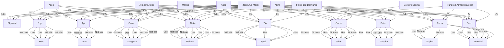

```mermaid

graph TD;

a[Physical];
b[Gun];
c[Agi];
d[Bufu];
e[Zio];
f[Garu];
g[Psy];
h[Nuke];
i[Bless];
j[Curse];

1[Joker];
2[Morgana];
3[Ryuji];
4[Ann];
5[Yusuke];
6[Makoto];
7[Haru];
8[Sophia];
9[Zenkichi];

		A[Alice] -- 1/2x --> g -- Not use --> 7;
	A -- 2x --> c -- Use --> 4;
	A -- 2x --> f -- Use --> 2;
	A -- 2x --> h -- Use --> 6;
	
		B[Ango] -- 1/2x --> a;
	B -- 1/2x --> c -- Not use --> 4;
	B -- 1/2x --> e -- Not use --> 3;
	B -- 1/2x --> f -- Not use --> 2;
	B -- 1/2x --> h -- Not use --> 6;
	B -- 1/2x --> j -- Not use --> 1;
	B -- 2x --> d -- Use --> 5;
	B -- 2x --> i -- Use --> 8;
	B -- 2x --> b -- Use --> 9;
	
		C[Mariko] -- 1/2x --> d -- Not use --> 5;
	C -- 1/2x --> e -- Not use --> 3;
	C -- 1/2x --> h -- Not use --> 6;
	C -- 2x --> g -- Use --> 7;
	C -- 2x --> j -- Use --> 1;
	C -- 2x --> f -- Use --> 2;
	
	D[Akane's Joker] -- 2x --> a;
	D -- 2x --> b -- Use --> 9;
	D -- 2x --> f -- Use --> 2;
	D -- 2x --> h -- Use --> 6;
	D -- 2x --> g -- Use --> 7;
	
	E[Zephyrus Mech] -- 1/2x --> c -- Not use --> 4;
	E -- 1/2x --> d -- Not use --> 5;
	E -- 1/2x --> f -- Not use --> 2;
	E -- 1/2x --> g -- Not use --> 7;
	E -- 1/2x --> i -- Not use --> 8;
	E -- 1/2x --> j -- Not use --> 1;
	E -- 2x --> e -- Use --> 3;
	E -- 2x --> h -- Use --> 6;
	E -- 2x --> a;
	E -- 2x --> b -- Use --> 9;
	
	F[Akira] -- 2x --> e -- Use --> 3;
	F -- 2x --> h -- Use --> 6;
	F -- 2x --> a;
	F -- 2x --> b -- Use --> 9;
	
	G[Berserk Sophia] -- 1/2x --> i -- Not use --> 8;
	G -- 2x --> j -- Use --> 1;
	
	H[Hundred-Armed Watcher] -- 1/x --> b -- Not use --> 9;
	H -- 1/2x --> j -- Not use --> 1;
	H -- 2x --> i -- Use --> 9;
	
	I[False god Demiurge] -- 1/2x --> c -- Not use --> 4;
	I -- 1/2x --> d -- Not use --> 5;
	I -- 1/2x --> e -- Not use --> 3;
	I -- 1/2x --> f -- Not use --> 2;
	I -- 1/2x --> g -- Not use --> 7;
	I -- 1/2x --> h -- Not use --> 6;
	I -- 2x --> i -- Use --> 9;
	I -- 2x --> j -- Use --> 1;
```
