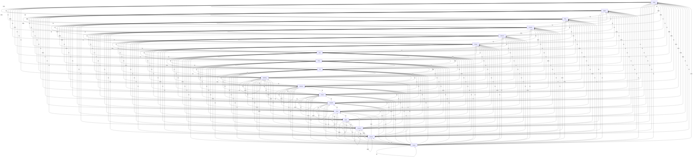

```mermaid

graph TD;
		A[Steel] -- 1/2x --> A;
	A -- 1/2x --> B[Water];
	A -- 1x --> C[Bug];
	A -- 1x --> D[Dragon];
	A -- 1/2x --> E[Electric];
	A -- 1x --> F[Ghost];
	A -- 1/2x --> G[Fire];
	A -- 2x --> H[Fairy];
	A -- 2x --> I[Ice];
	A -- 1x --> J[Fighting];
	A -- 1x --> K[Normal];
	A -- 1x --> L[Grass];
	A -- 1x --> M[Psychic];
	A -- 2x --> N[Rock];
	A -- 1x --> O[Dark];
	A -- 1x --> P[Ground];
	A -- 1x --> Q[Poison];
	A -- 1x --> R[Flying];

		B -- 1x --> A;
	B -- 1/2x --> B;
	B -- 1X --> C;
	B -- 1/2x --> D;
	B -- 1x --> E;
	B -- 1x --> F;
	B -- 2x --> G;
	B -- 1x --> H;
	B -- 1x --> I;
	B -- 1x --> J;
	B -- 1x --> K;
	B -- 1/2x --> L;
	B -- 1x --> M;
	B -- 2x --> N;
	B -- 1x --> O;
	B -- 2x --> P;
	B -- 1x --> Q;
	B -- 1x --> R;

		C -- 1/2x --> A;
	C -- 1x --> B;
	C -- 1x --> C;
	C -- 1x --> D;
	C -- 1x --> E;
	C -- 1/2x --> F;
	C -- 1/2x --> G;
	C -- 1/2x --> H;
	C -- 1x --> I;
	C -- 1/2x --> J;
	C -- 1x --> K;
	C -- 2x --> L;
	C -- 2x --> M;
	C -- 1x --> N;
	C -- 2x --> O;
	C -- 1x --> P;
	C -- 1/2x --> Q;
	C -- 1/2x --> R;

		D -- 1/2x --> A;
	D -- 1x --> B;
	D -- 1x --> C;
	D -- 2x --> D;
	D -- 1x --> E;
	D -- 1x --> F;
	D -- 1x --> G;
	D -- 1x --> H;
	D -- 0x --> I;
	D -- 1x --> J;
	D -- 1x --> K;
	D -- 1x --> L;
	D -- 1x --> M;
	D -- 1x --> N;
	D -- 1x --> O;
	D -- 1x --> P;
	D -- 1x --> Q;
	D -- 1x --> R;

		E -- 1x --> A;
	E -- 2x --> B;
	E -- 1x --> C;
	E -- 1/2x --> D;
	E -- 1/2x --> E;
	E -- 1x --> F;
	E -- 1x --> G;
	E -- 1x --> H;
	E -- 1x --> I;
	E -- 1x --> J;
	E -- 1x --> K;
	E -- 1/2x --> L;
	E -- 1x --> M;
	E -- 1x --> N;
	E -- 1x --> O;
	E -- 0x --> P;
	E -- 1x --> Q;
	E -- 2x --> R;

		F -- 1x --> A;
	F -- 1x --> B;
	F -- 1x --> C;
	F -- 1x --> D;
	F -- 1x --> E;
	F -- 2x --> F;
	F -- 1x --> G;
	F -- 1x --> H;
	F -- 1x --> I;
	F -- 1x --> J;
	F -- 0x --> K;
	F -- 1x --> L;
	F -- 2x --> M;
	F -- 1x --> N;
	F -- 1/2x --> O;
	F -- 1x --> P;
	F -- 1x --> Q;
	F -- 1x --> R;

		G -- 2x --> A;
	G -- 1/2x --> B;
	G -- 2X --> C;
	G -- 1/2x --> D;
	G -- 1x --> E;
	G -- 1x --> F;
	G -- 1/2x --> G;
	G -- 1x --> H;
	G -- 2x --> I;
	G -- 1x --> J;
	G -- 1x --> K;
	G -- 2x --> L;
	G -- 1x --> M;
	G -- 1/2x --> N;
	G -- 1x --> O;
	G -- 1x --> P;
	G -- 1x --> Q;
	G -- 1x --> R;

		H -- 1/2x --> A;
	H -- 1x --> B;
	H -- 1x --> C;
	H -- 2x --> D;
	H -- 1x --> E;
	H -- 1x --> F;
	H -- 1/2x --> G;
	H -- 1x --> H;
	H -- 1x --> I;
	H -- 2x --> J;
	H -- 1x --> K;
	H -- 1x --> L;
	H -- 1x --> M;
	H -- 1x --> N;
	H -- 2x --> O;
	H -- 1x --> P;
	H -- 1/2x --> Q;
	H -- 1x --> R;

		I -- 1/2x --> A;
	I -- 1/2x --> B;
	I -- 1x --> C;
	I -- 2x --> D;
	I -- 1x --> E;
	I -- 1x --> F;
	I -- 1/2x --> G;
	I -- 1x --> H;
	I -- 1/2x --> I;
	I -- 1x --> J;
	I -- 1x --> K;
	I -- 2x --> L;
	I -- 1x --> M;
	I -- 1x --> N;
	I -- 1x --> O;
	I -- 2x --> P;
	I -- 1x --> Q;
	I -- 2x --> R;

		J -- 2x --> A;
	J -- 1x --> B;
	J -- 1/2x --> C;
	J -- 1x --> D;
	J -- 1x --> E;
	J -- 0x --> F;
	J -- 1x --> G;
	J -- 1/2x --> H;
	J -- 2x --> I;
	J -- 1x --> J;
	J -- 2x --> K;
	J -- 1x --> L;
	J -- 1/2x --> M;
	J -- 2x --> N;
	J -- 2x --> O;
	J -- 1x --> P;
	J -- 1/2x --> Q;
	J -- 1/2x --> R;

		K -- 1/2x --> A;
	K -- 1x --> B;
	K -- 1x --> C;
	K -- 1x --> D;
	K -- 1x --> E;
	K -- 0x --> F;
	K -- 1x --> G;
	K -- 1x --> H;
	K -- 1x --> I;
	K -- 1x --> J;
	K -- 1x --> K;
	K -- 1x --> L;
	K -- 1x --> M;
	K -- 1/2x --> N;
	K -- 1x --> O;
	K -- 1x --> P;
	K -- 1x --> Q;
	K -- 1x --> R;

		L -- 1/2x --> A;
	L -- 2x --> B;
	L -- 1/2x --> C;
	L -- 1/2x --> D;
	L -- 1x --> E;
	L -- 1x --> F;
	L -- 1/2x --> G;
	L -- 1x --> H;
	L -- 1x --> I;
	L -- 1x --> J;
	L -- 1x --> K;
	L -- 1/2x --> L;
	L -- 1x --> M;
	L -- 2x --> N;
	L -- 1x --> O;
	L -- 2x --> P;
	L -- 1/2x --> Q;
	L -- 1/2x --> R;

		M -- 1/2x --> A;
	M -- 1x --> B;
	M -- 1x --> C;
	M -- 1x --> D;
	M -- 1x --> E;
	M -- 1x --> F;
	M -- 1x --> G;
	M -- 1x --> H;
	M -- 1x --> I;
	M -- 2x --> J;
	M -- 1x --> K;
	M -- 1x --> L;
	M -- 1/2x --> M;
	M -- 1x --> N;
	M -- 0x --> O;
	M -- 1x --> P;
	M -- 2x --> Q;
	M -- 1x --> R;

		N -- 1/2x --> A;
	N -- 1x --> B;
	N -- 2x --> C;
	N -- 1x --> D;
	N -- 1x --> E;
	N -- 1x --> F;
	N -- 2x --> G;
	N -- 1x --> H;
	N -- 2x --> I;
	N -- 1/2x --> J;
	N -- 1x --> K;
	N -- 1x --> L;
	N -- 1x --> M;
	N -- 1x --> N;
	N -- 1x --> O;
	N -- 1/2x --> P;
	N -- 1x --> Q;
	N -- 2x --> R;

		O -- 1x --> A;
	O -- 1x --> B;
	O -- 1x --> C;
	O -- 1x --> D;
	O -- 1x --> E;
	O -- 2x --> F;
	O -- 1x --> G;
	O -- 1/2x --> H;
	O -- 1x --> I;
	O -- 1/2x --> J;
	O -- 1x --> K;
	O -- 1x --> L;
	O -- 2x --> M;
	O -- 1x --> N;
	O -- 1/2x --> O;
	O -- 1x --> P;
	O -- 1x --> Q;
	O -- 1x --> R;

		P -- 2x --> A;
	P -- 1x --> B;
	P -- 1/2x --> C;
	P -- 1x --> D;
	P -- 2x --> E;
	P -- 1x --> F;
	P -- 2x --> G;
	P -- 1x --> H;
	P -- 1x --> I;
	P -- 1x --> J;
	P -- 1x --> K;
	P -- 1/2x --> L;
	P -- 1x --> M;
	P -- 2x --> N;
	P -- 1x --> O;
	P -- 1x --> P;
	P -- 2x --> Q;
	P -- 0x --> R;

		Q -- 0x --> A;
	Q -- 1x --> B;
	Q -- 1x --> C;
	Q -- 1x --> D;
	Q -- 1x --> E;
	Q -- 1/2x --> F;
	Q -- 1x --> G;
	Q -- 2x --> H;
	Q -- 1x --> I;
	Q -- 1x --> J;
	Q -- 1x --> K;
	Q -- 2x --> L;
	Q -- 1x --> M;
	Q -- 1/2x --> N;
	Q -- 1x --> O;
	Q -- 1/2x --> P;
	Q -- 1/2x --> Q;
	Q -- 1x --> R;

		R -- 1/2x --> A;
	R -- 1x --> B;
	R -- 2x --> C;
	R -- 1x --> D;
	R -- 1/2x --> E;
	R -- 1x --> F;
	R -- 1x --> G;
	R -- 1x --> H;
	R -- 1x --> I;
	R -- 2x --> J;
	R -- 1x --> K;
	R -- 2x --> L;
	R -- 1x --> M;
	R -- 1/2x --> N;
	R -- 1x --> O;
	R -- 1x --> P;
	R -- 1x --> Q;
	R -- 1x --> R;
```
